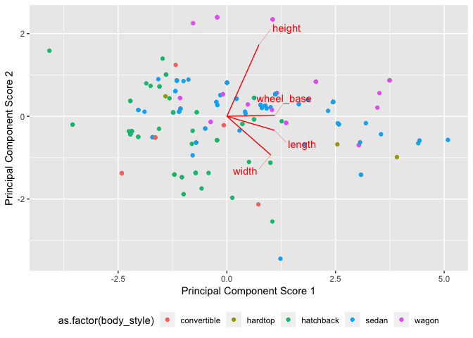
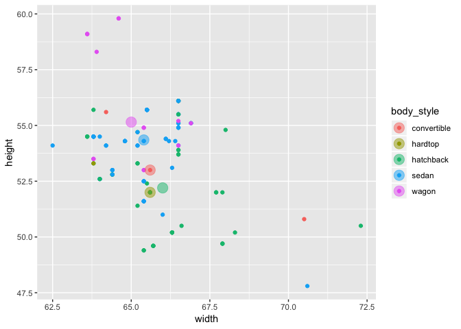
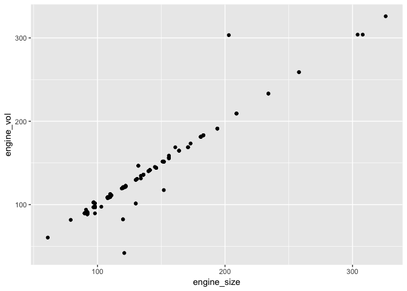
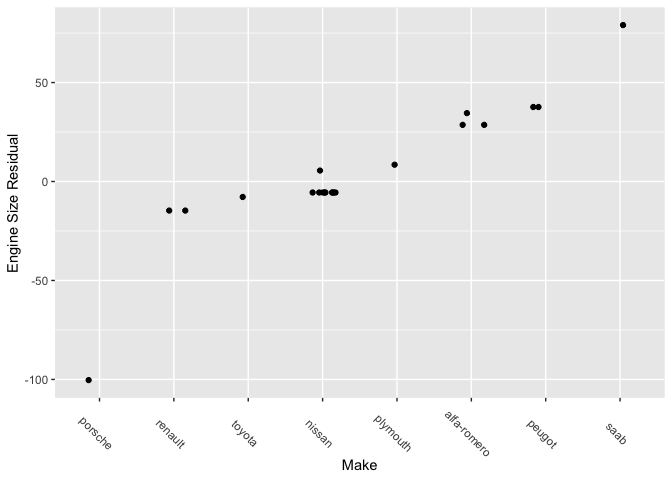
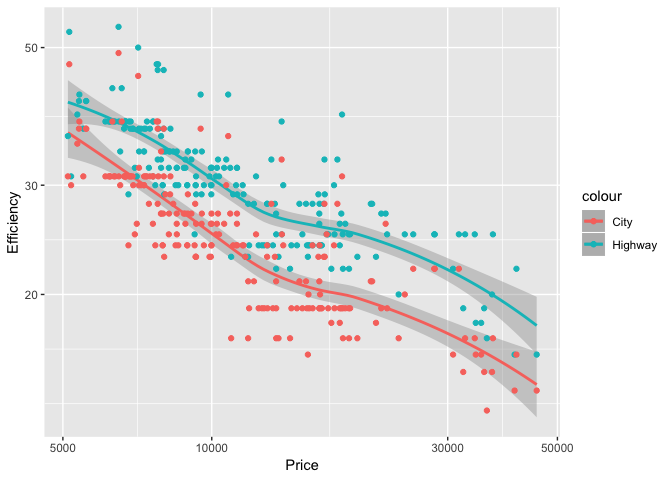

autos Backup
================
Zach
2018-09-04

The following is a pre-baked analysis of the UCI `autos`
    dataset.

    ## ── Attaching packages ─────────────────────────────────────────────────────────────────────────────────────────────────────────────────────────────────────────────────── tidyverse 1.2.1 ──

    ## ✔ ggplot2 3.0.0     ✔ purrr   0.2.5
    ## ✔ tibble  1.4.2     ✔ dplyr   0.7.6
    ## ✔ tidyr   0.8.1     ✔ stringr 1.3.1
    ## ✔ readr   1.1.1     ✔ forcats 0.3.0

    ## ── Conflicts ────────────────────────────────────────────────────────────────────────────────────────────────────────────────────────────────────────────────────── tidyverse_conflicts() ──
    ## ✖ dplyr::filter() masks stats::filter()
    ## ✖ dplyr::lag()    masks stats::lag()

    ## Loading required package: broom

## Wrangling

<!-- ------------------------------------------------- -->

The data are essentially in CSV format, though we’ll need to do some
wrangling.

``` r
df_raw <- 
  read_csv(
    file_name, 
    col_names = var_names,
    col_types = cols(
      .default = col_number(),
      symboling = col_integer(),
      normalized_losses = col_integer(),
      make = col_character(),
      fuel_type = col_character(),
      aspiration = col_character(),
      num_of_doors = col_character(), # Needs manual fix!
      body_style = col_character(),
      drive_wheels = col_character(),
      engine_location = col_character(),
      engine_type = col_character(),
      num_of_cylinders = col_character(), # Also needs manual fix!
      engine_size = col_integer(),
      fuel_system = col_character()
    )
  )
```

    ## Warning in rbind(names(probs), probs_f): number of columns of result is not
    ## a multiple of vector length (arg 1)

    ## Warning: 57 parsing failures.
    ## row # A tibble: 5 x 5 col     row col              expected   actual file                            expected   <int> <chr>            <chr>      <chr>  <chr>                           actual 1     1 normalized_loss… an integer ?      '~/Sync/data/autos/imports-85.… file 2     2 normalized_loss… an integer ?      '~/Sync/data/autos/imports-85.… row 3     3 normalized_loss… an integer ?      '~/Sync/data/autos/imports-85.… col 4     6 normalized_loss… an integer ?      '~/Sync/data/autos/imports-85.… expected 5     8 normalized_loss… an integer ?      '~/Sync/data/autos/imports-85.…
    ## ... ................. ... .......................................................................... ........ .......................................................................... ...... .......................................................................... .... .......................................................................... ... .......................................................................... ... .......................................................................... ........ ..........................................................................
    ## See problems(...) for more details.

The string-coded numbers are obnoxious; let’s map those to integers.

``` r
df_raw %>% pull(num_of_doors) %>% unique()
```

    ## [1] "two"  "four" "?"

``` r
df_raw %>% pull(num_of_cylinders) %>% unique()
```

    ## [1] "four"   "six"    "five"   "three"  "twelve" "two"    "eight"

``` r
df_autos <- 
  df_raw %>% 
  mutate(
    num_of_doors = parse_numchar(num_of_doors),
    num_of_cylinders = parse_numchar(num_of_cylinders)
  )
```

## Analysis

<!-- ------------------------------------------------- -->

First, a glimpse.

``` r
df_autos %>% glimpse()
```

    ## Observations: 205
    ## Variables: 26
    ## $ symboling         <int> 3, 3, 1, 2, 2, 2, 1, 1, 1, 0, 2, 0, 0, 0, 1,...
    ## $ normalized_losses <int> NA, NA, NA, 164, 164, NA, 158, NA, 158, NA, ...
    ## $ make              <chr> "alfa-romero", "alfa-romero", "alfa-romero",...
    ## $ fuel_type         <chr> "gas", "gas", "gas", "gas", "gas", "gas", "g...
    ## $ aspiration        <chr> "std", "std", "std", "std", "std", "std", "s...
    ## $ num_of_doors      <int> 2, 2, 2, 4, 4, 2, 4, 4, 4, 2, 2, 4, 2, 4, 4,...
    ## $ body_style        <chr> "convertible", "convertible", "hatchback", "...
    ## $ drive_wheels      <chr> "rwd", "rwd", "rwd", "fwd", "4wd", "fwd", "f...
    ## $ engine_location   <chr> "front", "front", "front", "front", "front",...
    ## $ wheel_base        <dbl> 88.6, 88.6, 94.5, 99.8, 99.4, 99.8, 105.8, 1...
    ## $ length            <dbl> 168.8, 168.8, 171.2, 176.6, 176.6, 177.3, 19...
    ## $ width             <dbl> 64.1, 64.1, 65.5, 66.2, 66.4, 66.3, 71.4, 71...
    ## $ height            <dbl> 48.8, 48.8, 52.4, 54.3, 54.3, 53.1, 55.7, 55...
    ## $ curb_weight       <dbl> 2548, 2548, 2823, 2337, 2824, 2507, 2844, 29...
    ## $ engine_type       <chr> "dohc", "dohc", "ohcv", "ohc", "ohc", "ohc",...
    ## $ num_of_cylinders  <int> 4, 4, 6, 4, 5, 5, 5, 5, 5, 5, 4, 4, 6, 6, 6,...
    ## $ engine_size       <int> 130, 130, 152, 109, 136, 136, 136, 136, 131,...
    ## $ fuel_system       <chr> "mpfi", "mpfi", "mpfi", "mpfi", "mpfi", "mpf...
    ## $ bore              <dbl> 3.47, 3.47, 2.68, 3.19, 3.19, 3.19, 3.19, 3....
    ## $ stroke            <dbl> 2.68, 2.68, 3.47, 3.40, 3.40, 3.40, 3.40, 3....
    ## $ compression_ratio <dbl> 9.00, 9.00, 9.00, 10.00, 8.00, 8.50, 8.50, 8...
    ## $ horsepower        <dbl> 111, 111, 154, 102, 115, 110, 110, 110, 140,...
    ## $ peak_rpm          <dbl> 5000, 5000, 5000, 5500, 5500, 5500, 5500, 55...
    ## $ city_mpg          <dbl> 21, 21, 19, 24, 18, 19, 19, 19, 17, 16, 23, ...
    ## $ highway_mpg       <dbl> 27, 27, 26, 30, 22, 25, 25, 25, 20, 22, 29, ...
    ## $ price             <dbl> 13495, 16500, 16500, 13950, 17450, 15250, 17...

The numeric variables seem to break down into

Geometry | `wheel_base`, `length`, `width`, `height`, `curb_weight` |  
Engine | `engine_size`, `num_of_cylinders`, `engine_size`, `bore`,
`stroke`, `compression_ratio`, `horsepower`, `peak_rpm` |  
Efficiency | `city_mpg`, `highway_mpg` |  
Monetary | `price` |

**q1** What is the relationship between the geometric variables
`length`, `width`, `height`, and `wheel_base`?

``` r
pca_geom <- 
  df_autos %>% 
  mutate_at(vars(length, width, height, wheel_base), .funs = log10) %>% 
  tidy_pca(length, width, height, wheel_base)

pca_geom %>% 
  unnest(pc_frac)
```

    ## # A tibble: 4 x 2
    ##     sig sig_frac
    ##   <dbl>    <dbl>
    ## 1 1.73     0.520
    ## 2 0.876    0.784
    ## 3 0.366    0.894
    ## 4 0.351    1

``` r
pca_geom %>% 
  unnest(pc_weights)
```

    ## # A tibble: 4 x 5
    ##   var          PC1     PC2    PC3    PC4
    ##   <chr>      <dbl>   <dbl>  <dbl>  <dbl>
    ## 1 length     0.547 -0.168   0.595 -0.564
    ## 2 width      0.506 -0.467  -0.714 -0.123
    ## 3 height     0.370  0.868  -0.273 -0.188
    ## 4 wheel_base 0.554  0.0134  0.247  0.795

There’s a fair bit of structure here; the leading two components capture
about `78`% of the variability. The leading principal component has
positive weight on all variables – it corresponds to generic ‘size’ of a
vehicle. PC2 is an approximate aspect ratio\* – it describes increases
in height with decreases in width, and smaller decreases in length. PC3
is another form of aspect ratio

\*This isn’t a proper aspect ratio, as it is not a true dimensionless
quantity. It has units of length to the 0.2454524 power.

``` r
pca_geom %>% 
  do_pca_plot(body_style)
```

<!-- -->

We can see this if we select an interior slice of PC1 (to control
overall size) and plot height against width.

``` r
pca_geom %>% 
  unnest(data_aug) %>% 
  mutate_at(vars(width, height), ~10 ^ .) %>% 
  filter(abs(PC1) < 1.5) %>%
  ggplot(aes(width, height, color = body_style)) +
  geom_point() +
  geom_point(
    data = . %>%
      group_by(body_style) %>%
      summarize(
        width = median(width, na.rm = TRUE),
        height = median(height, na.rm = TRUE)
      ),
    size = 5,
    alpha = 1 / 2
  )
```

<!-- -->

**q2** What is the relationship between the engine variables
`engine_size`, `bore`, `stroke`, `compression_ratio`, and
`num_of_cylinders`?

``` r
pca_engine <- 
  df_autos %>% 
  filter_at(vars(engine_size, bore, stroke, compression_ratio, num_of_cylinders), all_vars(!is.na(.))) %>% 
  mutate_at(vars(engine_size, bore, stroke, compression_ratio), log10) %>%
  tidy_pca(engine_size, bore, stroke, compression_ratio, num_of_cylinders)

pca_engine %>% 
  unnest(pc_frac)
```

    ## # A tibble: 5 x 2
    ##     sig sig_frac
    ##   <dbl>    <dbl>
    ## 1 1.47     0.320
    ## 2 1.08     0.556
    ## 3 0.934    0.759
    ## 4 0.860    0.946
    ## 5 0.246    1

The engine variables are not particularly well-described by the first
two PCA compoments. At three we get a decent reduction.

``` r
pca_engine %>% 
  unnest(pc_weights) %>% 
  mutate(PC1 = - PC1)
```

    ## # A tibble: 5 x 6
    ##   var                   PC1     PC2     PC3      PC4      PC5
    ##   <chr>               <dbl>   <dbl>   <dbl>    <dbl>    <dbl>
    ## 1 engine_size       0.668    0.0532 -0.0524  0.00473 -0.741  
    ## 2 bore              0.489   -0.171   0.355  -0.668    0.399  
    ## 3 stroke            0.103    0.719  -0.585  -0.310    0.184  
    ## 4 compression_ratio 0.00528  0.670   0.711   0.214    0.00389
    ## 5 num_of_cylinders  0.552   -0.0537 -0.149   0.642    0.508

Engine size should be directly related to the bore (cylinder diameter),
stroke (cylinder swept height), and number of cylinders. Let’s check
this.

``` r
df_engine <- 
  df_autos %>% 
  mutate(
    cyl_vol = stroke * (bore / 2) ^ 2 * pi,
    engine_vol = cyl_vol * num_of_cylinders,
    resid = engine_size - engine_vol
  )

## Computed fit
df_engine %>% 
  ggplot(aes(engine_size, engine_vol)) +
  geom_point()
```

    ## Warning: Removed 4 rows containing missing values (geom_point).

<!-- -->

``` r
## Residual plot
df_engine %>% 
  filter(abs(resid) > 5) %>% 
  ggplot(aes(fct_reorder(make, resid), resid)) +
  geom_jitter(width = 0.2, height = 0) +
  theme(
    axis.text.x = element_text(angle = 315)
  ) +
  labs(
    x = "Make",
    y = "Engine Size Residual"
  )
```

<!-- -->

The calculated engine volume is almost perfect; however, there are some
outliers. I’ve not managed to determine where this discrepancy comes
from.

**q3** What about dimensionality made these questions hard?

1.  Choosing subsets of variables required domain-specific knowledge
2.  There are many variables to interpret simultaneously.

**q4** What else is going on in these data?

There’s a very funny relationship between vehicle price and efficiency:

``` r
df_autos %>% 
  ggplot(aes(price)) +
  geom_smooth(aes(y = highway_mpg, color = "Highway")) +
  geom_smooth(aes(y = city_mpg, color = "City")) +
  geom_point(aes(y = highway_mpg, color = "Highway")) +
  geom_point(aes(y = city_mpg, color = "City")) +
  scale_x_log10() +
  scale_y_log10() +
  labs(
    x = "Price",
    y = "Efficiency"
  )
```

    ## `geom_smooth()` using method = 'loess' and formula 'y ~ x'

    ## Warning: Removed 4 rows containing non-finite values (stat_smooth).

    ## `geom_smooth()` using method = 'loess' and formula 'y ~ x'

    ## Warning: Removed 4 rows containing non-finite values (stat_smooth).

    ## Warning: Removed 4 rows containing missing values (geom_point).
    
    ## Warning: Removed 4 rows containing missing values (geom_point).

<!-- -->

More expensive cars are less efficient\! You get what you pay for, I
suppose….
