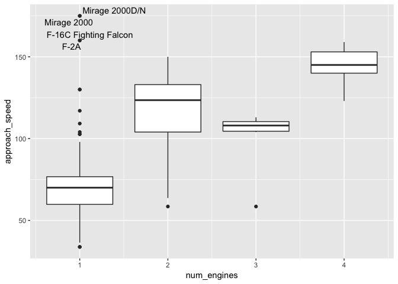

Aircraft Characteristics
================
ZDR
2018-08-13

-   [Full scatterplot matrix](#full-scatterplot-matrix)
-   [Presentation helpers](#presentation-helpers)

The following is a glimpse at the FAA Aircraft Characteristics [database](https://www.faa.gov/airports/engineering/aircraft_char_database/). These data are used for sizing airports, and were most recently updated January 2018.

    ## 
    ## Attaching package: 'GGally'

    ## The following object is masked from 'package:dplyr':
    ## 
    ##     nasa

There are a number of comments at the top of this Excel FAA data; let's skip all of that.

``` r
df_raw <-
    filename_faa %>%
    read_excel(skip = 4)
```

First, some basic facts.

``` r
names_orig <- names(df_raw)
names_orig
```

    ##  [1] "Date Completed"               "Manufacturer"                
    ##  [3] "Model"                        "Physical Class (Engine Type)"
    ##  [5] "# Engines"                    "AAC"                         
    ##  [7] "ADG"                          "TDG"                         
    ##  [9] "Approach Speed\r\n(Vref)"     "Wingspan, ft"                
    ## [11] "Wingtip Configuration"        "Length, ft"                  
    ## [13] "Tail Height, ft\r\n(@ OEW)"   "Wheelbase, ft"               
    ## [15] "Cockpit to Main Gear (CMG)"   "MGW\r\n(Outer to Outer)"     
    ## [17] "MTOW"                         "Max Ramp\r\nMax Taxi"        
    ## [19] "Main Gear Configuration"      "ICAO/FAA Code"               
    ## [21] "ATCT Weight Class"            "Years Manufactured"

Looking at the Excel file, some of these ought to be numeric. Also, the variable names are obnoxious. Let's do some wrangling.

``` r
df_faa <-
    df_raw %>%
    rename_all(str_to_lower) %>%
    rename_all(~str_remove(., pattern = "\\(.*\\)")) %>%
    rename_all(~str_remove(., pattern = ",.*$")) %>%
    rename_all(~str_remove(., pattern = "\\s+$")) %>%
    rename_all(~str_replace_all(., pattern = "\\s+", replacement = "_")) %>%
    rename_all(~str_replace_all(., pattern = "#", replacement = "num")) %>%
    rename_all(~str_replace_all(., pattern = "/", replacement = "_")) %>%
    rename(
        cmg = cockpit_to_main_gear
    ) %>%
    mutate_at(
        .vars = vars(
            approach_speed,
            wingspan,
            length,
            tail_height,
            mtow,
            cmg,
            mgw,
            max_ramp_max_taxi
        ),
        .funs = as.numeric
    ) %>%
    mutate(
        num_engines = as.integer(num_engines)
    )

df_key <-
    tibble(
        var = names(df_faa),
        description = names_orig
    )

df_key %>%
    knitr::kable()
```

| var                       | description                  |
|:--------------------------|:-----------------------------|
| date\_completed           | Date Completed               |
| manufacturer              | Manufacturer                 |
| model                     | Model                        |
| physical\_class           | Physical Class (Engine Type) |
| num\_engines              | \# Engines                   |
| aac                       | AAC                          |
| adg                       | ADG                          |
| tdg                       | TDG                          |
| approach\_speed           | Approach Speed               |
| (Vref)                    |                              |
| wingspan                  | Wingspan, ft                 |
| wingtip\_configuration    | Wingtip Configuration        |
| length                    | Length, ft                   |
| tail\_height              | Tail Height, ft              |
| (@ OEW)                   |                              |
| wheelbase                 | Wheelbase, ft                |
| cmg                       | Cockpit to Main Gear (CMG)   |
| mgw                       | MGW                          |
| (Outer to Outer)          |                              |
| mtow                      | MTOW                         |
| max\_ramp\_max\_taxi      | Max Ramp                     |
| Max Taxi                  |                              |
| main\_gear\_configuration | Main Gear Configuration      |
| icao\_faa\_code           | ICAO/FAA Code                |
| atct\_weight\_class       | ATCT Weight Class            |
| years\_manufactured       | Years Manufactured           |

Full scatterplot matrix
-----------------------

<!-- -------------------------------------------------- -->
Let's focus on the numeric variables for now. A set of pair plots will give us a first impression if there's any structure in the data.


It seems there's quite a bit of structure! Dimensional Analysis (and John Tukey) would suggest that log-transforming the data might straighten things out.


Now let's run a PCA to identify any low-dimensional structure.

``` r
df_pca_log %>% pull(pc_frac)
```

    ## [[1]]
    ## # A tibble: 5 x 2
    ##      sig sig_frac
    ##    <dbl>    <dbl>
    ## 1 2.15      0.692
    ## 2 0.550     0.869
    ## 3 0.167     0.922
    ## 4 0.146     0.969
    ## 5 0.0956    1

About `87%` of the variance is explained by two directions; this is something we can plot.

``` r
df_pca_log %>%
    do_pca_plot(aac)
```


[Approach speed](https://www.skybrary.aero/index.php/Approach_Speed_Categorisation) is legally stratified into classes A-E; a fact that is visible in the figure above. The first principal component is strongly dependent on the aircraft geometry, while the second is quite aligned with the approach speed.

``` r
df_faa %>%
    ggplot(aes(num_engines, approach_speed, group = num_engines)) +
    geom_boxplot() +
    geom_text_repel(
        data = df_faa %>% filter(approach_speed > 150, num_engines == 1L),
        mapping = aes(label = model)
    )
```

    ## Warning: Removed 725 rows containing missing values (stat_boxplot).

    ## Warning: Removed 139 rows containing non-finite values (stat_boxplot).



As we might expect, the approach speed varies with the number of engines. The fastest (on approach) single-engine aircraft are military.

``` r
df_pca_2 <-
    df_log %>%
    do_pca(
        log10_wingspan,
        log10_length,
        log10_cmg,
        log10_mtow,
        log10_tail_height,
        log10_mgw
    )

df_pca_2 %>% pull(pc_frac)
```

    ## [[1]]
    ## # A tibble: 6 x 2
    ##      sig sig_frac
    ##    <dbl>    <dbl>
    ## 1 2.39      0.689
    ## 2 0.437     0.815
    ## 3 0.247     0.886
    ## 4 0.185     0.940
    ## 5 0.121     0.974
    ## 6 0.0886    1

``` r
df_pca_2 %>%
    do_pca_plot(num_engines)
```


Many of these interrelations can be derived from scaling laws. For example, lift arises from a pressure differential, so it tends to scale proportional to wing area. Area has units of length squared; if we assume a constant aspect ratio across all aircraft (false, but certainly bounded), then the wing area scales as the wingspan squared. Maximum takeoff weight (MTOW) scales proportional to lift. Thus we may expect a roughly quadratic relation between wingspan and MTOW.

``` r
df_log %>%
    ggplot(aes(log10_wingspan, log10_mtow, color = log10_length)) +
    geom_point() +
    geom_smooth(se = FALSE) +
    geom_abline(slope = 2, intercept = 1, linetype = 2)
```

    ## `geom_smooth()` using method = 'gam' and formula 'y ~ s(x, bs = "cs")'

    ## Warning: Removed 613 rows containing non-finite values (stat_smooth).

    ## Warning: Removed 613 rows containing missing values (geom_point).


Here we see the power-law fit captures a large part of the trend; coloring the points by aircraft length suggests that other geometric variations (i.e. varying aspect ratio) account for part of the misfit.

Presentation helpers
--------------------

<!-- -------------------------------------------------- -->
Art recommended presenting individual pair plots; this will be helpful for pedagogical purposes.

``` r
df_faa %>%
    ggplot(aes(length, wingspan)) +
    geom_point() +
    theme_common()
```

    ## Warning: Removed 735 rows containing missing values (geom_point).


``` r
mysave("faa_wingspan_v_length")
```

    ## Warning: Removed 735 rows containing missing values (geom_point).

``` r
df_faa %>%
    ggplot(aes(mtow, wingspan)) +
    geom_point() +
    theme_common()
```

    ## Warning: Removed 613 rows containing missing values (geom_point).


``` r
mysave("faa_wingspan_v_mtow")
```

    ## Warning: Removed 613 rows containing missing values (geom_point).

``` r
df_faa %>%
    ggplot(aes(approach_speed, wingspan)) +
    geom_point() +
    theme_common()
```

    ## Warning: Removed 611 rows containing missing values (geom_point).


``` r
mysave("faa_wingspan_v_approach_speed")
```

    ## Warning: Removed 611 rows containing missing values (geom_point).

Now let's aggregate these into a scatterplot matrix.

``` r
df_faa %>%
    select(wingspan, length, mtow, approach_speed) %>%
    ggpairs()
```

    ## plot: [1,1] [==>------------------------------------------] 6% est: 0s

    ## Warning: Removed 603 rows containing non-finite values (stat_density).

    ## plot: [1,2] [=====>---------------------------------------] 12% est: 1s

    ## Warning in (function (data, mapping, alignPercent = 0.6, method =
    ## "pearson", : Removed 735 rows containing missing values

    ## plot: [1,3] [=======>-------------------------------------] 19% est: 1s

    ## Warning in (function (data, mapping, alignPercent = 0.6, method =
    ## "pearson", : Removed 613 rows containing missing values

    ## plot: [1,4] [==========>----------------------------------] 25% est: 1s

    ## Warning in (function (data, mapping, alignPercent = 0.6, method =
    ## "pearson", : Removed 611 rows containing missing values

    ## plot: [2,1] [=============>-------------------------------] 31% est: 1s

    ## Warning: Removed 735 rows containing missing values (geom_point).

    ## plot: [2,2] [================>----------------------------] 38% est: 1s

    ## Warning: Removed 735 rows containing non-finite values (stat_density).

    ## plot: [2,3] [===================>-------------------------] 44% est: 1s

    ## Warning in (function (data, mapping, alignPercent = 0.6, method =
    ## "pearson", : Removed 743 rows containing missing values

    ## plot: [2,4] [=====================>-----------------------] 50% est: 1s

    ## Warning in (function (data, mapping, alignPercent = 0.6, method =
    ## "pearson", : Removed 743 rows containing missing values

    ## plot: [3,1] [========================>--------------------] 56% est: 1s

    ## Warning: Removed 613 rows containing missing values (geom_point).

    ## plot: [3,2] [===========================>-----------------] 62% est: 0s

    ## Warning: Removed 743 rows containing missing values (geom_point).

    ## plot: [3,3] [==============================>--------------] 69% est: 0s

    ## Warning: Removed 612 rows containing non-finite values (stat_density).

    ## plot: [3,4] [=================================>-----------] 75% est: 0s

    ## Warning in (function (data, mapping, alignPercent = 0.6, method =
    ## "pearson", : Removed 618 rows containing missing values

    ## plot: [4,1] [====================================>--------] 81% est: 0s

    ## Warning: Removed 611 rows containing missing values (geom_point).

    ## plot: [4,2] [======================================>------] 88% est: 0s

    ## Warning: Removed 743 rows containing missing values (geom_point).

    ## plot: [4,3] [=========================================>---] 94% est: 0s

    ## Warning: Removed 618 rows containing missing values (geom_point).

    ## plot: [4,4] [=============================================]100% est: 0s

    ## Warning: Removed 607 rows containing non-finite values (stat_density).


``` r
mysave("faa_min_scatter")
```

    ## plot: [1,1] [==>------------------------------------------] 6% est: 0s

    ## Warning: Removed 603 rows containing non-finite values (stat_density).

    ## plot: [1,2] [=====>---------------------------------------] 12% est: 1s

    ## Warning in (function (data, mapping, alignPercent = 0.6, method =
    ## "pearson", : Removed 735 rows containing missing values

    ## plot: [1,3] [=======>-------------------------------------] 19% est: 1s

    ## Warning in (function (data, mapping, alignPercent = 0.6, method =
    ## "pearson", : Removed 613 rows containing missing values

    ## plot: [1,4] [==========>----------------------------------] 25% est: 1s

    ## Warning in (function (data, mapping, alignPercent = 0.6, method =
    ## "pearson", : Removed 611 rows containing missing values

    ## plot: [2,1] [=============>-------------------------------] 31% est: 1s

    ## Warning: Removed 735 rows containing missing values (geom_point).

    ## plot: [2,2] [================>----------------------------] 38% est: 1s

    ## Warning: Removed 735 rows containing non-finite values (stat_density).

    ## plot: [2,3] [===================>-------------------------] 44% est: 1s

    ## Warning in (function (data, mapping, alignPercent = 0.6, method =
    ## "pearson", : Removed 743 rows containing missing values

    ## plot: [2,4] [=====================>-----------------------] 50% est: 1s

    ## Warning in (function (data, mapping, alignPercent = 0.6, method =
    ## "pearson", : Removed 743 rows containing missing values

    ## plot: [3,1] [========================>--------------------] 56% est: 0s

    ## Warning: Removed 613 rows containing missing values (geom_point).

    ## plot: [3,2] [===========================>-----------------] 62% est: 0s

    ## Warning: Removed 743 rows containing missing values (geom_point).

    ## plot: [3,3] [==============================>--------------] 69% est: 0s

    ## Warning: Removed 612 rows containing non-finite values (stat_density).

    ## plot: [3,4] [=================================>-----------] 75% est: 0s

    ## Warning in (function (data, mapping, alignPercent = 0.6, method =
    ## "pearson", : Removed 618 rows containing missing values

    ## plot: [4,1] [====================================>--------] 81% est: 0s

    ## Warning: Removed 611 rows containing missing values (geom_point).

    ## plot: [4,2] [======================================>------] 88% est: 0s

    ## Warning: Removed 743 rows containing missing values (geom_point).

    ## plot: [4,3] [=========================================>---] 94% est: 0s

    ## Warning: Removed 618 rows containing missing values (geom_point).

    ## plot: [4,4] [=============================================]100% est: 0s

    ## Warning: Removed 607 rows containing non-finite values (stat_density).

Let's demonstrate how a log transform straightens things out.

``` r
df_faa %>%
    select(wingspan, length, mtow, approach_speed) %>%
    mutate_all(log10) %>%
    ggpairs()
```

    ## plot: [1,1] [==>------------------------------------------] 6% est: 0s

    ## Warning: Removed 603 rows containing non-finite values (stat_density).

    ## plot: [1,2] [=====>---------------------------------------] 12% est: 1s

    ## Warning in (function (data, mapping, alignPercent = 0.6, method =
    ## "pearson", : Removed 735 rows containing missing values

    ## plot: [1,3] [=======>-------------------------------------] 19% est: 1s

    ## Warning in (function (data, mapping, alignPercent = 0.6, method =
    ## "pearson", : Removed 613 rows containing missing values

    ## plot: [1,4] [==========>----------------------------------] 25% est: 1s

    ## Warning in (function (data, mapping, alignPercent = 0.6, method =
    ## "pearson", : Removed 611 rows containing missing values

    ## plot: [2,1] [=============>-------------------------------] 31% est: 1s

    ## Warning: Removed 735 rows containing missing values (geom_point).

    ## plot: [2,2] [================>----------------------------] 38% est: 1s

    ## Warning: Removed 735 rows containing non-finite values (stat_density).

    ## plot: [2,3] [===================>-------------------------] 44% est: 1s

    ## Warning in (function (data, mapping, alignPercent = 0.6, method =
    ## "pearson", : Removed 743 rows containing missing values

    ## plot: [2,4] [=====================>-----------------------] 50% est: 1s

    ## Warning in (function (data, mapping, alignPercent = 0.6, method =
    ## "pearson", : Removed 743 rows containing missing values

    ## plot: [3,1] [========================>--------------------] 56% est: 1s

    ## Warning: Removed 613 rows containing missing values (geom_point).

    ## plot: [3,2] [===========================>-----------------] 62% est: 1s

    ## Warning: Removed 743 rows containing missing values (geom_point).

    ## plot: [3,3] [==============================>--------------] 69% est: 0s

    ## Warning: Removed 612 rows containing non-finite values (stat_density).

    ## plot: [3,4] [=================================>-----------] 75% est: 0s

    ## Warning in (function (data, mapping, alignPercent = 0.6, method =
    ## "pearson", : Removed 618 rows containing missing values

    ## plot: [4,1] [====================================>--------] 81% est: 0s

    ## Warning: Removed 611 rows containing missing values (geom_point).

    ## plot: [4,2] [======================================>------] 88% est: 0s

    ## Warning: Removed 743 rows containing missing values (geom_point).

    ## plot: [4,3] [=========================================>---] 94% est: 0s

    ## Warning: Removed 618 rows containing missing values (geom_point).

    ## plot: [4,4] [=============================================]100% est: 0s

    ## Warning: Removed 607 rows containing non-finite values (stat_density).


``` r
mysave("faa_min_scatter_log")
```

    ## plot: [1,1] [==>------------------------------------------] 6% est: 0s

    ## Warning: Removed 603 rows containing non-finite values (stat_density).

    ## plot: [1,2] [=====>---------------------------------------] 12% est: 1s

    ## Warning in (function (data, mapping, alignPercent = 0.6, method =
    ## "pearson", : Removed 735 rows containing missing values

    ## plot: [1,3] [=======>-------------------------------------] 19% est: 1s

    ## Warning in (function (data, mapping, alignPercent = 0.6, method =
    ## "pearson", : Removed 613 rows containing missing values

    ## plot: [1,4] [==========>----------------------------------] 25% est: 1s

    ## Warning in (function (data, mapping, alignPercent = 0.6, method =
    ## "pearson", : Removed 611 rows containing missing values

    ## plot: [2,1] [=============>-------------------------------] 31% est: 1s

    ## Warning: Removed 735 rows containing missing values (geom_point).

    ## plot: [2,2] [================>----------------------------] 38% est: 1s

    ## Warning: Removed 735 rows containing non-finite values (stat_density).

    ## plot: [2,3] [===================>-------------------------] 44% est: 1s

    ## Warning in (function (data, mapping, alignPercent = 0.6, method =
    ## "pearson", : Removed 743 rows containing missing values

    ## plot: [2,4] [=====================>-----------------------] 50% est: 1s

    ## Warning in (function (data, mapping, alignPercent = 0.6, method =
    ## "pearson", : Removed 743 rows containing missing values

    ## plot: [3,1] [========================>--------------------] 56% est: 1s

    ## Warning: Removed 613 rows containing missing values (geom_point).

    ## plot: [3,2] [===========================>-----------------] 62% est: 0s

    ## Warning: Removed 743 rows containing missing values (geom_point).

    ## plot: [3,3] [==============================>--------------] 69% est: 0s

    ## Warning: Removed 612 rows containing non-finite values (stat_density).

    ## plot: [3,4] [=================================>-----------] 75% est: 0s

    ## Warning in (function (data, mapping, alignPercent = 0.6, method =
    ## "pearson", : Removed 618 rows containing missing values

    ## plot: [4,1] [====================================>--------] 81% est: 0s

    ## Warning: Removed 611 rows containing missing values (geom_point).

    ## plot: [4,2] [======================================>------] 88% est: 0s

    ## Warning: Removed 743 rows containing missing values (geom_point).

    ## plot: [4,3] [=========================================>---] 94% est: 0s

    ## Warning: Removed 618 rows containing missing values (geom_point).

    ## plot: [4,4] [=============================================]100% est: 0s

    ## Warning: Removed 607 rows containing non-finite values (stat_density).

Finally, let's do an example PCA.

``` r
df_min_pca <-
    df_faa %>%
    filter(
        !is.na(wingspan),
        !is.na(length),
        !is.na(tail_height),
        !is.na(cmg),
        !is.na(mgw),
        !is.na(mtow),
        !is.na(approach_speed),
    ) %>%
    tidy_pca(wingspan, length, mtow, approach_speed)

df_min_pca %>%
    pull(pc_frac) %>%
    knitr::kable()
```

<table class="kable_wrapper">
<tbody>
<tr>
<td>
|        sig|  sig\_frac|
|----------:|----------:|
|  1.8653236|  0.6367258|
|  0.6580057|  0.8613352|
|  0.2535432|  0.9478818|
|  0.1526830|  1.0000000|

</td>
</tr>
</tbody>
</table>
``` r
df_min_pca %>%
    do_pca_plot(num_engines)
```


``` r
mysave("faa_min_pca_plot")
```
