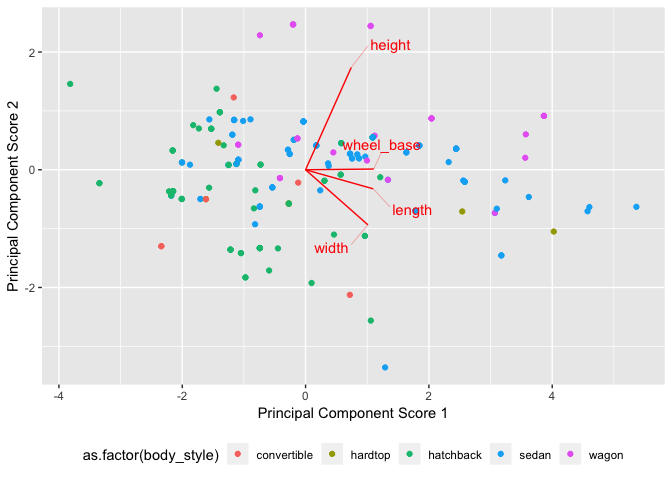
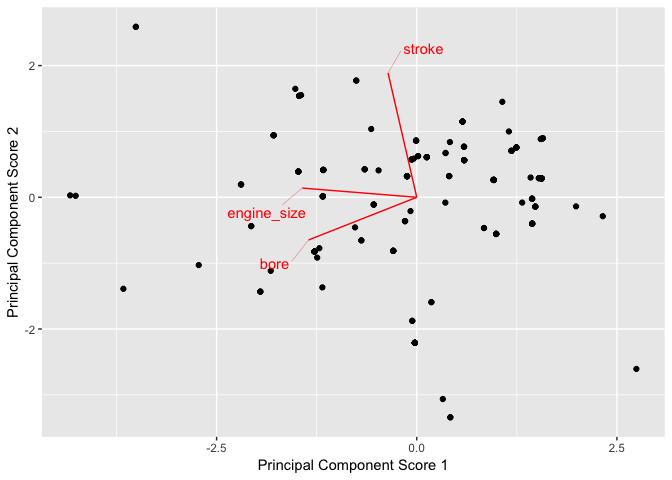

autos Live
================
The Wellesley Math Department
2018-09-06

The following is a collaborative analysis of the
[UCI](https://archive.ics.uci.edu/ml/datasets/automobile) `autos`
dataset – you’ll need to download it to run this Rmarkdown file. The
data are automobile characteristics and (actuarial) risk assments for
imported vehicles in 1985.

Also see the `backup_autos.Rmd` for a ‘pre-baked’ look at the same
    data.

    ## ── Attaching packages ─────────────────────────────────────────────────────────────────────────────────────────────────────────────────────────────────────────────────── tidyverse 1.2.1 ──

    ## ✔ ggplot2 3.0.0     ✔ purrr   0.2.5
    ## ✔ tibble  1.4.2     ✔ dplyr   0.7.6
    ## ✔ tidyr   0.8.1     ✔ stringr 1.3.1
    ## ✔ readr   1.1.1     ✔ forcats 0.3.0

    ## ── Conflicts ────────────────────────────────────────────────────────────────────────────────────────────────────────────────────────────────────────────────────── tidyverse_conflicts() ──
    ## ✖ dplyr::filter() masks stats::filter()
    ## ✖ dplyr::lag()    masks stats::lag()

    ## Loading required package: broom

## Wrangling

<!-- ------------------------------------------------- -->

The data are essentially in CSV format, though we’ll need to do some
wrangling.

``` r
df_raw <- 
  read_csv(
    file_name, 
    col_names = var_names,
    col_types = cols(
      .default = col_number(),
      symboling = col_integer(),
      normalized_losses = col_integer(),
      make = col_character(),
      fuel_type = col_character(),
      aspiration = col_character(),
      num_of_doors = col_character(),     # Needs manual fix!
      body_style = col_character(),
      drive_wheels = col_character(),
      engine_location = col_character(),
      engine_type = col_character(),
      num_of_cylinders = col_character(), # Also needs manual fix!
      engine_size = col_integer(),
      fuel_system = col_character()
    )
  )
```

    ## Warning in rbind(names(probs), probs_f): number of columns of result is not
    ## a multiple of vector length (arg 1)

    ## Warning: 57 parsing failures.
    ## row # A tibble: 5 x 5 col     row col              expected   actual file                            expected   <int> <chr>            <chr>      <chr>  <chr>                           actual 1     1 normalized_loss… an integer ?      '~/Sync/data/autos/imports-85.… file 2     2 normalized_loss… an integer ?      '~/Sync/data/autos/imports-85.… row 3     3 normalized_loss… an integer ?      '~/Sync/data/autos/imports-85.… col 4     6 normalized_loss… an integer ?      '~/Sync/data/autos/imports-85.… expected 5     8 normalized_loss… an integer ?      '~/Sync/data/autos/imports-85.…
    ## ... ................. ... .......................................................................... ........ .......................................................................... ...... .......................................................................... .... .......................................................................... ... .......................................................................... ... .......................................................................... ........ ..........................................................................
    ## See problems(...) for more details.

The string-coded numbers are obnoxious; let’s map those to integers.

``` r
df_raw %>% pull(num_of_doors) %>% unique()
```

    ## [1] "two"  "four" "?"

``` r
df_raw %>% pull(num_of_cylinders) %>% unique()
```

    ## [1] "four"   "six"    "five"   "three"  "twelve" "two"    "eight"

``` r
df_autos <- 
  df_raw %>% 
  mutate(
    num_of_doors = parse_numchar(num_of_doors),
    num_of_cylinders = parse_numchar(num_of_cylinders)
  )
```

## Analysis

<!-- ------------------------------------------------- -->

``` r
df_autos %>% 
  glimpse()
```

    ## Observations: 205
    ## Variables: 26
    ## $ symboling         <int> 3, 3, 1, 2, 2, 2, 1, 1, 1, 0, 2, 0, 0, 0, 1,...
    ## $ normalized_losses <int> NA, NA, NA, 164, 164, NA, 158, NA, 158, NA, ...
    ## $ make              <chr> "alfa-romero", "alfa-romero", "alfa-romero",...
    ## $ fuel_type         <chr> "gas", "gas", "gas", "gas", "gas", "gas", "g...
    ## $ aspiration        <chr> "std", "std", "std", "std", "std", "std", "s...
    ## $ num_of_doors      <int> 2, 2, 2, 4, 4, 2, 4, 4, 4, 2, 2, 4, 2, 4, 4,...
    ## $ body_style        <chr> "convertible", "convertible", "hatchback", "...
    ## $ drive_wheels      <chr> "rwd", "rwd", "rwd", "fwd", "4wd", "fwd", "f...
    ## $ engine_location   <chr> "front", "front", "front", "front", "front",...
    ## $ wheel_base        <dbl> 88.6, 88.6, 94.5, 99.8, 99.4, 99.8, 105.8, 1...
    ## $ length            <dbl> 168.8, 168.8, 171.2, 176.6, 176.6, 177.3, 19...
    ## $ width             <dbl> 64.1, 64.1, 65.5, 66.2, 66.4, 66.3, 71.4, 71...
    ## $ height            <dbl> 48.8, 48.8, 52.4, 54.3, 54.3, 53.1, 55.7, 55...
    ## $ curb_weight       <dbl> 2548, 2548, 2823, 2337, 2824, 2507, 2844, 29...
    ## $ engine_type       <chr> "dohc", "dohc", "ohcv", "ohc", "ohc", "ohc",...
    ## $ num_of_cylinders  <int> 4, 4, 6, 4, 5, 5, 5, 5, 5, 5, 4, 4, 6, 6, 6,...
    ## $ engine_size       <int> 130, 130, 152, 109, 136, 136, 136, 136, 131,...
    ## $ fuel_system       <chr> "mpfi", "mpfi", "mpfi", "mpfi", "mpfi", "mpf...
    ## $ bore              <dbl> 3.47, 3.47, 2.68, 3.19, 3.19, 3.19, 3.19, 3....
    ## $ stroke            <dbl> 2.68, 2.68, 3.47, 3.40, 3.40, 3.40, 3.40, 3....
    ## $ compression_ratio <dbl> 9.00, 9.00, 9.00, 10.00, 8.00, 8.50, 8.50, 8...
    ## $ horsepower        <dbl> 111, 111, 154, 102, 115, 110, 110, 110, 140,...
    ## $ peak_rpm          <dbl> 5000, 5000, 5000, 5500, 5500, 5500, 5500, 55...
    ## $ city_mpg          <dbl> 21, 21, 19, 24, 18, 19, 19, 19, 17, 16, 23, ...
    ## $ highway_mpg       <dbl> 27, 27, 26, 30, 22, 25, 25, 25, 20, 22, 29, ...
    ## $ price             <dbl> 13495, 16500, 16500, 13950, 17450, 15250, 17...

## Questions

<!-- ------------------------------------------------- -->

**q1** What is the relationship between the geometric variables
`length`, `width`, `height`, and `wheel_base`?

``` r
pca_geo <- 
  df_autos %>% 
  tidy_pca(length, width, height, wheel_base)

pca_geo %>% 
  pull(pc_frac)
```

    ## [[1]]
    ## # A tibble: 4 x 2
    ##     sig sig_frac
    ##   <dbl>    <dbl>
    ## 1 1.73     0.523
    ## 2 0.873    0.787
    ## 3 0.365    0.897
    ## 4 0.341    1

At two dimensions, we capture ~`79`% of the variability in the data –
this is usable low-dimensional structure.

``` r
pca_geo %>%
  do_pca_plot(col_var = body_style)
```

<!-- -->

Interpreting the PCA directions, we see that `height`, `wheel_base`,
`length`, and `width` are all positively related with the first
direction – this first direction seems to correspond to vehicle size.

The second direction is positively related with `height`, and negatively
related with `width` – this is a sort of aspect ratio.

Plotting body type on the PCA scores, we see that sedans tend to be
scattered along the 1st direction, will little variation on the second.
It seems these sedans come in different sizes, but do not vary much in
shape (aspect ratio).

**q2** What is the relationship between the engine variables
`engine_size`, `bore`, `stroke`, `compression_ratio`, and
`num_of_cylinders`?

We suspect all of these variables are positively correlated, as the all
pertain to the size of the engine. We can start by analying a subset of
them

``` r
pca_engine <- 
  df_autos %>% 
  filter_at(vars(engine_size, bore, stroke), all_vars(!is.na(.))) %>% 
  tidy_pca(engine_size, bore, stroke)

pca_engine %>% 
  pull(pc_frac)
```

    ## [[1]]
    ## # A tibble: 3 x 2
    ##     sig sig_frac
    ##   <dbl>    <dbl>
    ## 1 1.27     0.441
    ## 2 1.02     0.794
    ## 3 0.593    1

We can capture most of the variability with two out of three dimensions.

``` r
pca_engine %>% 
  do_pca_plot()
```

<!-- -->

It’s a bit inconvenient, but the engine size is negatively correlated
with the first PCA direction – the first direction depends primarily on
engine size and bore. The second direction depends primarily on stroke.

**q3** What about dimensionality made these questions hard?

**q4** What else is going on in these data?
